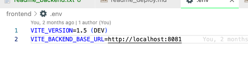

# backend

# frontend (vue vite)

- yarn build
- fix erro about tsscript ($filters -> filters)
- running on production or development (import.meta.env.PROD), https://vitejs.dev/guide/env-and-mode.html
- npx serve -s ./dist

# backend (ts-script)

- npm i -g typescript dotenv ts-node ts-node-dev
- yarn build
- update mongo url (data-source.ts)
- dotenv_config_path=/custom/path/to/.env

```js
"scripts": {
      "start": "ts-node-dev -r dotenv/config src/index.ts",
      "mac_start": "ROOT_PATH=/Users/chaiyasittayabovorn/Desktop/Training/ReactJS_Training/react_mern_dist/workshops/cmpos_mern_ts/backend/backend-ts ts-node-dev src/index.ts",
      "win_start": "SET ROOT_PATH=/Users/chaiyasittayabovorn/Desktop/Training/ReactJS_Training/react_mern_dist/workshops/cmpos_mern_ts/backend/backend-ts& ts-node-dev src/index.ts",
      "build": "tsc && cp *.key .env ecosystem.config.js ./build",
      "build-docker": "tsc && cp *.key ./build",
      "typeorm": "typeorm-ts-node-commonjs"
   }
```

# env (dev and production)

- https://vitejs.dev/guide/env-and-mode.html
- .env and .env.production
- import.meta.env.VITE_VERSION



```
VITE_VERSION=1.5 (DEV)
VITE_BACKEND_BASE_URL=http://localhost:8081
```
